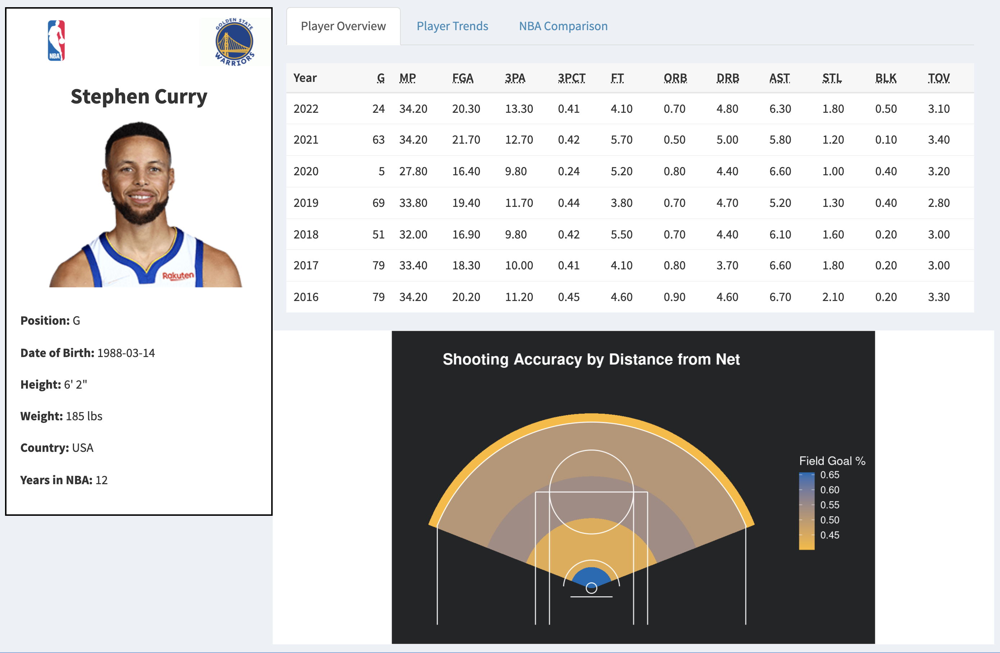
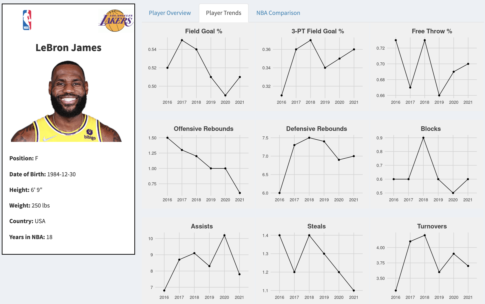
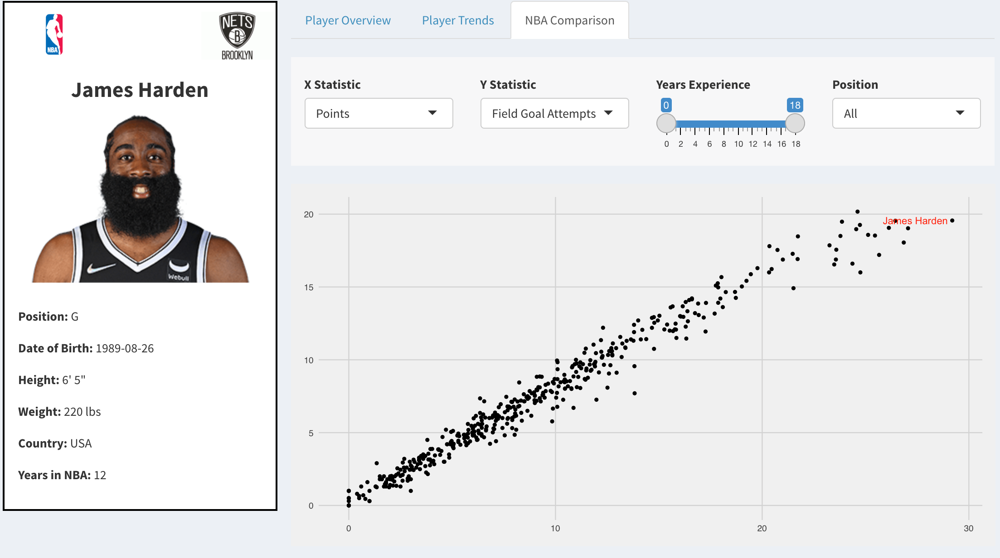

```{r, include = FALSE}
knitr::opts_chunk$set(
  collapse = TRUE,
  comment = "#>"
)
```

```{r setup}
library(nbaanalysis)
```

## 1 - Introduction

Prior to the turn of the century, data analytics and sports were two things that were seen by many as mutually exclusive. Advancements in the field of data science and the rise of big data, however, have changed the way most American professional sport’s teams evaluate athlete performance and implement game-time strategies. All of which has been possible due to the plethora of data collected on every angle of the game, which has given way to many organizations utilizing a wide array of data visualization techniques to better understand their data. 
   
The National Basketball Association (NBA) is one area of American professional sports where data visualization has become integral to how teams digest and evaluate player efficiency. This is much in part due to the high pace, high scoring, and consistent back-and-forth manner in which the game is played, coupled with a 24 second shot clock that attempts to maximize the number of points scored. Such makes collecting NBA data task a menial task and augments the accessibility of meaningful metrics that correspond to a player's productivity on the floor. With that in mind, our group decided to use NBA player statistics as the focal point of this project, primarily due to personal interest in the game, but also because preliminary analysis revealed the extensive amount of in-depth data available for every player in the league. 
   
The objective of this project was to build a package in R called nbaanalysis() that could be used to construct a Shiny Dashboard based on the individual NBA player data available on [this website](https://www.basketball-reference.com/). This dashboard was designed to give the user the ability the analyze and visualize NBA player performance data on a multitude of levels, ranging from viewing high-level performance metrics to conducting exploratory and player-to-player comparisons. 

## 2 - Data Extraction 

After locating a reliable NBA data source, our first step in the data extraction process was to decide the specific player statistics to pull, in addition to how many season's worth of data would be conducive for analysis. Since the focus of our dashboard was to enable player-to-player comparison and display player performance trends, it was imperative that the data we collected was representative of players who played during the same "era" in the NBA. With that in mind, the two factors we considered when deciding how to limit our data pull, was how the game has evolved over time and the average length of a NBA player's career. 
   
The biggest change in how basketball has been played over the years has been the increased utility of the three-point shot. Even though the three-point shot was first introduced back in the 1980s, it took until the early 2010's for teams to maximize how such a shot is used on a per-game basis. Since 2012, the average number of three-point shots taken on a per team basis has increased by nearly 50%. This trend can be attributed to the concurrent rise of applying machine learning and other statistical methods to optimize a team's shooting strategy and probability of winning, all of which resulted in similar conclusions: **shoot more three pointers**. The one team in particular that maximized this finding was the Golden State Warriors, whom made five consecutive NBA Finals between 2015-2019 and set the record for most wins in a regular season. This Warriors dynasty was built primarily around a three-point offense, centered by Steph Curry and Klay Thompson, who are both arguably two of the best three-point shooters in NBA history. 

In addition to discerning how the three-point shot has transformed the NBA into the league that it is today, we also researched the length of an average NBA career. With stars in today's game like LeBron James and Carmelo Anthony leading long, successful careers of 15+ years in the league, it can be difficult to see that such examples are the exception, rather than the norm. Making a fifteen-man NBA roster is arguably one of the most difficult tasks one can undertake in the professional sport's world, due to the influx of collegiate talent that replenishes the league each year and the growth of the game overseas. With that mind, it should come as no surprise that the average NBA career is approximately 5.5 years long, which attests to the difficultly it takes for one to maintain longevity in the league. Taking both of these feats into consideration, we decided to pull player data only from the 2016-2022 NBA seasons. Constraining our data to this range ensured that our Shiny App depicted the most current players, and allowed for performance comparisons for players who played during the same NBA era.

From a metrics selection standpoint, we decided to focus our data extraction on two tables from [this](https://www.basketball-reference.com/) website. One table displayed player stats on a per game basis and included generic metrics from both an offensive and defensive perspective. The second table contained strictly shooting percentages from varying distances on the court. In order to web scrape this data, we divided the task into two parts. First we downloaded the raw HTML files via `get_shooting_data.R` and `get_per_game_data.R` from the website. In both files, we used the `rvest` package to scrape the relevant URLs that downloads NBA shooting data and the overall per game data for the 2016-2022 NBA season. In both instances, we used `SelectorGadget` to generate the necessary CSS selectors that point to the relevant URL. We stored the output (html files) from `get_shooting_data.R` and `get_per_game_data.R` into the `data-raw` folder. To process and tidy the data, we created the `process_data.R script`, which leverages helper functions and the `map_dfr` function from `purrr`, to create two clean and tidy tibbles saved in the `/data` folder. 

We also extracted player statistics, such as their position, most recent team, height, weight, etc. In order to do so, we combined json data that contained the desired variables, as well as an uploaded txt file that contained the conversion between the unique team ID and the team's full name and abbreviation. After some data processing like merging the two datasets together and type conversion, we stored the tidied dataframe into the `/data` folder. 

## 3 - Data Visualization & Walkthrough

To best visualize NBA player data, we decided to build a multi-layered Shiny Dashboard with three tabs: Player Overview, Player Trends, and NBA Comparison. The Player Overview tab was designed to give the user high-level shooting per season metrics for a particular NBA player of interest. The data presented on this tab visualizes the shooting data in both a tabular and graphic display to give the user the ability the discern insight from both angles. One could utilize this tab to hone in on a particular player or metric of interest, which could then be further explored in later sections of this dashboard. 

Upon running the application, the user will be first directed to the Player Overview tab where they will have the option to select a NBA player. To accomplish this, one can filter the data by first selecting a team (via the "Pick Team" selector), which filters the subsequent player option. Additionally, one can type the name of a player in the "Pick Player" selector to choose a player of interest. For the "Pick Player" selector, we decided to use the `selectizeInput()` function from the JavaScript library because of its flexible interface compared to a traditional select input or text input. The major advantage of using `selectizeInput()` is that it uses string matching to match the inputted user text to the applicable player names. 

The subsequent visualizations depend on a player to be selected. By default, Stephen Curry is selected but if the user happens to clears the select input box, the app will validate the need for the input in the server and provide an appropriate message. Once a player is selected, as the visualizations are loading for each tab, a loading spinner appears while the ui elements are rendering. 

Upon a player selection, the Player Overview tab will populate and split the screen into three separate panes. The left of the screen will populate with a player card containing the player's photo, team logo and miscellaneous personal statistics such as height, weight, and number of years in the NBA using the `player_stats` dataset. This player card will remain on the screen for each of the three views. The right side of the dashboard is broken into two panes: one containing a summary table of per-game player stats and the bottom pane containing a shooting heat map. 

The summary table is populated using a reactive dataframe while filters by the player selected and displayed using reactable. The headers of the table are abbreviations for the commonly found basketball statistics. If the user hovers over a given name, a tooltip will appear with a longer name description. 

The heat map depicts the player's shooting percentage from the following distances: 0-3 feet, 3-10 feet, 10-16 feet, 16 feet - 3 pointer, and from beyond the 3 point arch. The radial area for these distances is colored based on the player's shooting accuracy, and the gradient used corresponds to the player's current NBA team colors. Additionally, the heat map was built on top of a "to scale" NBA court in order to give the user a sense of how these distance correspond to actual locations on the court. Since the official three point line is not a perfect semicircle, we decided to use a wedge-shaped object on the heat map to illustrate the differences in the player's shooting percentages. The logic to render the plot is abstracted using functions residing in `heatmap_functions.R`. In this file there is `generate_circle()` which is a function that returns randomly generated points along the circumference of a circle with user inputted radius and center coordinates. Additionally, there is `plot_heatmap()` which takes in the average shooting accuracy for a given player across the specified distances, and returns a ggplot object with the gradient heatmap plotted on top of the court diagram. Note that the gradient color scale is bounded by the two primary colors for that player's current team. 

```{r out.width = "75%", fig.align = "center", echo=FALSE}

```

The graphic above is an example of what the Player Overview tab would look like for Steph Curry of the Golden State Warriors. To many, Curry is considered the greatest outside shooter of all time, which can be supported by the shooting heat map showing he's approximately 45% accurate from three point range. To put this into prespective, the average NBA player typically only shoots 30-35% from this range, due to the complexity it takes to make a basket from 20-25 feet out. 

The second tab in the dashboard is labeled "Player Trends," which was designed to depict player performance trends over time broken out by nine unique statistics that best capture production on the court. Each statistic is plotted on a separate line graph for the player selected over the 2016-2022 seasons. The metrics selected can be broken into three distinct areas:

* Offensive Efficiency: Field Goal %, Three Point %, Free Throw %
* Non-Shooting Efficiency: Offensive Rebounds, Defensive Rebounds, Blocks
* Ball Handling Efficiency: Assists, Steals, Turnovers

Since basketball is a game that can be measured from a multitude of angles, using this many trend plots provides the user with a holistic view into the development of the selected player over time. For the plots in this tab and the comparisons tab, we decided to use the FiveThirtyEight theme from the ggthemes package, since this theme provided a nice contrast to the overall layout of the dashboard. 

```{r out.width = "75%", fig.align = "center", echo=FALSE}

```

An example image of the Player Trends tab can be seen above for LeBron James. Looking at the image, we can see that many of his player statistics have declined since the 2019 season. While this may be attributed to recent injuries and him approaching the end of his career, his trade from the Cleveland Cavaliers to the Los Angeles Lakers also factored into this decline. On the Cavaliers, James played had a weaker supporting cast, and therefore had to shoulder much of the team's offensive burden. On the contrast, the Los Angeles Lakers roster have much more talent both on the court and on the bench, and thus enable James to take on a more supporting role. 

The final tab in the dashboard is labeled "NBA Comparison," which was designed to give the user maximum flexibility when conducting exploratory data analysis on player-to-player comparisons. The premise of this visualization is a scatter plot, where each point represents a different player, and the axes are dynamic, where the user has the option to select from a number of different NBA statistic combinations. The number of points (players) in the plot can be filtered from numerous angles, such as by player position or number of years in the NBA. Once the user selects a player of interest, his point in the scatter plot will change from black to red to enable easy detection. The construction of this dashboard maximizes the degree of interactivity the user has with the visualization, which allows them to be able to easily toggle between a multitude of views. 

It should be noted that the values in this plot corresponds to a player's average over the 2016-2022 seasons. Since the objective of this plot was to enable the user the ability to compare a plethora of players at once, we felt it was more fitting to use average values, rather than per season values, as seen in the "Trends" tab. From a operational perspective, one could use this visualization if they were interested in comparing players from the same team or position, and wanted to have the flexibility to easily switch between a number of statistics. Additionally, this graphic provides a perfect tool conducive for outlier detection if one were interested in seeing for example who the best three-point shooter on the Golden State Warriors was, or which NBA center had the most defensive rebounds. 

```{r out.width = "75%", fig.align = "center", echo=FALSE}

```

An example image of the NBA Comparison tab for James Harden can be seen above. Harden's location on the plot (red text) depicts that he is an outlier when comparing points and field goal attempts, which supports the fact that he's been one of the most prolific shooters in the league for the past decade. 

## 4 - References
 
 * STA - 523 Lecture Notes
 * R Packages: Chapter 11 - Vignettes
 * https://kubicle.com/blog/data-analytics-sports/ 
 * https://weaksideawareness.wordpress.com/2011/11/22/average-nba-career-length-for-players-details/ 
 * https://www.basketball-reference.com/  
 

